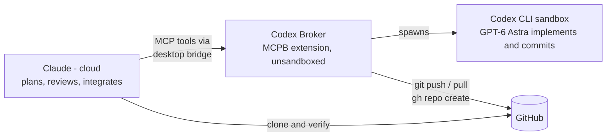

# Claude Desktop Codex Broker

Delegate coding tasks from Claude (Cowork / Claude Desktop / Claude Code) to OpenAI's Codex CLI (GPT-6 Astra by default, GPT-5.6 Sol as the relief executor) — with Claude planning and quality-controlling, Codex implementing, and a hardened broker handling everything the Codex sandbox cannot.

Codex usage bills to your ChatGPT plan; orchestration runs on your Claude plan. The two AIs cross-check each other: uncorrelated errors are the point.

## Model roles

The delegation skill pins each model to one role (standing hierarchy, ratified 2026-08-06, amended 2026-09-08 for GPT-6 Astra). Full text and rationale: [skill/SKILL.md](skill/SKILL.md#model-hierarchy-standing-ratified-2026-08-06-amended-2026-09-08).

| Model | Tier | Role | Effort | When |
|---|---|---|---|---|
| Claude Fable 5.1 | Overlord | Normative rulings, contract changes, phase-boundary review, final accountability. Verdict outranks everything. | n/a | Boundaries and rulings. Never routine execution. |
| Claude Opus (latest) | Default orchestrator | Runs sessions: scopes tasks, writes delegation prompts, runs the gates, merges. | Max | Every ordinary execution session. Contract questions go to Fable. |
| GPT-6 Astra (Codex) | Executor and adversarial reviewer | Attacks Fable's plans before build. Implements bounded tasks. Reviews Claude-authored code. | `ultra` for reviews and batches; `max` for scoped implementation, via per-call `reasoning_effort` | Default for every delegation. |
| GPT-5.6 Sol (Codex) | Relief executor | Bounded mechanical implementation when Astra quota is short. Fallback if Astra access lapses. Lint-grade second pass on Astra diffs. | Max | Per-call `model` override only. Never the global default while Astra is available. Never long-horizon work. |
| GPT-5.6 Terra, Luna | Unassigned | In the Codex catalog; no role until there is a reason to test them. | n/a | Do not use. |

**Fable-coding gate.** Fable's context is the scarcest resource in the loop, and the user plans it. Fable writes code only with the user's explicit, per-task permission, asked in chat before the first edit. When Astra fails a hard task the fallback order is a tighter `codex_resume`, then a narrower fresh delegation, then asking the user whether Fable takes it over. Sol is never the fallback for hard tasks.

## What's in this repo

| Path | Contents |
|---|---|
| `server/` | Broker MCP server source (Node, zero-dependency runtime + @modelcontextprotocol/sdk), integration suite with a mock Codex harness |
| `skill/` | `codex-delegation` Claude skill — role architecture, git protocol, GPT prompting conventions |
| `scripts/` | Deterministic packagers for both published artifacts; each takes `--verify` to check a built archive against its source |
| `docs/` | [Architecture](docs/ARCHITECTURE.md) · [Windows install guide](docs/INSTALL-WINDOWS.md) · [Field-testing lessons](docs/LESSONS.md) |

Built packages are published on the
[Releases page](https://github.com/Pliskin-Industries/claude-desktop-codex-broker/releases/latest),
not committed to the repo — CI builds them from source on each tagged version.

## Quick start — Claude Desktop / Cowork

1. Prerequisites: Node 18.18+, `npm install -g @openai/codex`, `codex login` (ChatGPT subscription or API key), GitHub CLI (`gh auth login`) for repo operations.
2. Download `codex-broker.mcpb` from the [latest release](https://github.com/Pliskin-Industries/claude-desktop-codex-broker/releases/latest), then Claude Desktop → Settings → Extensions → drag the file in.
3. Optional but recommended: clone this repo, run `npm ci --prefix server`, and set the extension's **Broker checkout** setting to the clone. From then on a broker update is `git pull` plus a tray-restart of Claude Desktop — no rebuild, no reinstall.
4. Download `codex-delegation.skill` from the same release and save it to your Claude account (upload in the conversation or Settings → Skills).
5. Start a new Cowork session — the tools appear as `mcp__remote-devices__Codex_Broker__*`.

Full walkthrough with verification steps: [docs/INSTALL-WINDOWS.md](docs/INSTALL-WINDOWS.md).

## Quick start — Claude Code

Clone the repo, open Claude Code inside it, and say: **"Set up the Codex broker per CLAUDE.md."** Claude Code checks prerequisites, installs server deps, installs the skill, configures the Codex CLI (keep-awake, model and effort defaults via `scripts/configure-codex.mjs`), runs the test suite, and tells you the one step it can't do for you (`codex login`). The repo's `.mcp.json` provides the project-scoped server (tools appear as `mcp__codex-broker__*`); [CLAUDE.md](CLAUDE.md) includes the user-scoped registration command for using the broker from any directory.

Details and the manual path: [docs/INSTALL-CLAUDE-CODE.md](docs/INSTALL-CLAUDE-CODE.md).

## Tools

`codex_task` (sync, <45s jobs) · `codex_start` / `codex_status` / `codex_result` / `codex_cancel` (background jobs — the default for real work) · `codex_review` (read-only review) · `codex_resume` (continue a thread) · `git_push` / `git_pull` / `git_commit` / `git_clone` / `gh_repo_create` / `gh_pr_create` / `gh_issue_create` / `gh_read` (broker-side git/GitHub — credentialed, validated, outside the Codex sandbox; `gh_read` is a read-only allowlisted dispatcher for `pr` / `issue` / `run` / `release` / `repo` queries, which also makes the broker a lightweight GitHub bridge for Claude Desktop chat and Cowork). Background jobs report seconds since their output last grew and warn when they go quiet; pass `max_idle_seconds` to have the broker kill a stalled job instead of leaving it for hours (v1.6.0, [LESSONS #9](docs/LESSONS.md)). Every codex tool accepts `reasoning_effort` (low, medium, high, xhigh, max, ultra) to override the `~/.codex/config.toml` default for that call alone — `ultra` for reviews, `max` for scoped implementation (v1.7.0).

## The security model, in one paragraph

Codex runs inside its own OS-level sandbox as a separate user, with filesystem writes confined to the target project and no network or credential access — it can create, edit, and commit, but can never push, pull, or touch your GitHub auth. Remote git operations go through dedicated broker tools that run outside the sandbox, are invoked explicitly by the orchestrating Claude after reviewing the work, never force-push, and validate every argument against injection. Credentials are never visible to either AI model. The broker refuses `danger-full-access` and approval-bypass flags at the argument-builder level.

## License

MIT — see [LICENSE](LICENSE).
