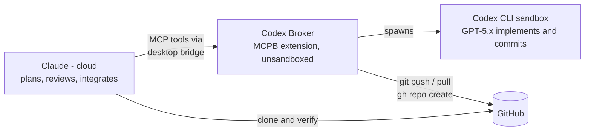

# Claude Desktop Codex Broker

Delegate coding tasks from Claude (Cowork / Claude Desktop / Claude Code, locally or on the web) to OpenAI's Codex CLI (GPT-5.x models) — with Claude planning and quality-controlling, Codex implementing, and a hardened broker handling everything the Codex sandbox cannot.

Orchestration runs on your Claude plan. Codex usage bills to whichever credential you give it: a ChatGPT plan via `codex login` or `CODEX_ACCESS_TOKEN`, or the OpenAI API — billed separately, per token — via `OPENAI_API_KEY`. The two AIs cross-check each other: uncorrelated errors are the point.

Two machines, with GitHub as the only shared surface. In a hosted container (Claude Code on the web) Claude and Codex share one filesystem instead, so the GitHub round trip collapses — see [Cloud install](docs/INSTALL-CLOUD.md).

## What's in this repo

| Path | Contents |
|---|---|
| `server/` | Broker MCP server source (Node, zero-dependency runtime + @modelcontextprotocol/sdk), 41-test suite with a mock Codex harness |
| `skill/` | `codex-delegation` Claude skill — role architecture, git protocol, GPT prompting conventions |
| `scripts/` | Build (`build-mcpb.sh`, `build-skill.sh`), package verification (`verify-mcpb.mjs`), and cloud provisioning (`cloud-setup.sh`, `preflight.mjs`) |
| `dist/` | Ready-to-install packages: `codex-broker.mcpb` (drag into Claude Desktop → Settings → Extensions) and `codex-delegation.skill` |
| `docs/` | [Architecture](docs/ARCHITECTURE.md) · [Windows install](docs/INSTALL-WINDOWS.md) · [Claude Code install](docs/INSTALL-CLAUDE-CODE.md) · [Cloud install](docs/INSTALL-CLOUD.md) · [Field-testing lessons](docs/LESSONS.md) |

## Quick start — Claude Desktop / Cowork

1. Prerequisites: Node 18.18+, `npm install -g @openai/codex`, `codex login` (ChatGPT subscription or API key), GitHub CLI (`gh auth login`) for repo operations.
2. Install `dist/codex-broker.mcpb`: Claude Desktop → Settings → Extensions → drag the file in.
3. Save `dist/codex-delegation.skill` to your Claude account (upload in the conversation or Settings → Skills).
4. Start a new Cowork session — the tools appear as `mcp__remote-devices__Codex_Broker__*`.

Full walkthrough with verification steps: [docs/INSTALL-WINDOWS.md](docs/INSTALL-WINDOWS.md).

## Quick start — Claude Code

Clone the repo, open Claude Code inside it, and say: **"Set up the Codex broker per CLAUDE.md."** Claude Code checks prerequisites, installs server deps, installs the skill, runs the test suite, and tells you the one step it can't do for you (`codex login`). The repo's `.mcp.json` provides the project-scoped server (tools appear as `mcp__codex-broker__*`); [CLAUDE.md](CLAUDE.md) includes the user-scoped registration command for using the broker from any directory.

Details and the manual path: [docs/INSTALL-CLAUDE-CODE.md](docs/INSTALL-CLAUDE-CODE.md).

## Quick start — Claude Code on the web

Two things must be set on the environment before anything works, and neither can be done from inside the container:

1. **Allowlist `api.openai.com`** in the environment's network policy. Hosted sessions route HTTPS through a policy-enforcing proxy; without this every Codex call dies on `HTTP CONNECT failed with status 403`. That is an org policy denial, not a broken install — it must be fixed at the policy, not worked around.
2. **Set a credential as an environment secret** — `CODEX_ACCESS_TOKEN` (reuses your ChatGPT plan) or `OPENAI_API_KEY` (separate per-token API billing). Interactive `codex login` needs a browser and cannot run headless.

Then `bash scripts/cloud-setup.sh` provisions everything, and `.claude/hooks/session-start.sh` re-runs it each session — the container is ephemeral, so dependencies and login do not survive. Diagnose anything that fails with `node scripts/preflight.mjs`, which names *which* kind of failure occurred.

Full guide: [docs/INSTALL-CLOUD.md](docs/INSTALL-CLOUD.md).

## Tools

`codex_task` (sync, <45s jobs) · `codex_start` / `codex_status` / `codex_result` / `codex_cancel` (background jobs — the default for real work) · `codex_review` (read-only review) · `codex_resume` (continue a thread) · `git_push` / `git_pull` / `git_commit` / `git_clone` / `gh_repo_create` / `gh_pr_create` / `gh_issue_create` / `gh_read` (broker-side git/GitHub — credentialed, validated, outside the Codex sandbox; `gh_read` is a read-only allowlisted dispatcher for `pr` / `issue` / `run` / `release` / `repo` queries, which also makes the broker a lightweight GitHub bridge for Claude Desktop chat and Cowork).

## The security model, in one paragraph

Codex runs inside its own OS-level sandbox as a separate user, with filesystem writes confined to the target project and no network or credential access — it can create, edit, and commit, but can never push, pull, or touch your GitHub auth. Remote git operations go through dedicated broker tools that run outside the sandbox, are invoked explicitly by the orchestrating Claude after reviewing the work, never force-push, and validate every argument against injection. Credentials are never visible to either AI model. The broker refuses `danger-full-access` and approval-bypass flags at the argument-builder level.

## License

MIT — see [LICENSE](LICENSE).
