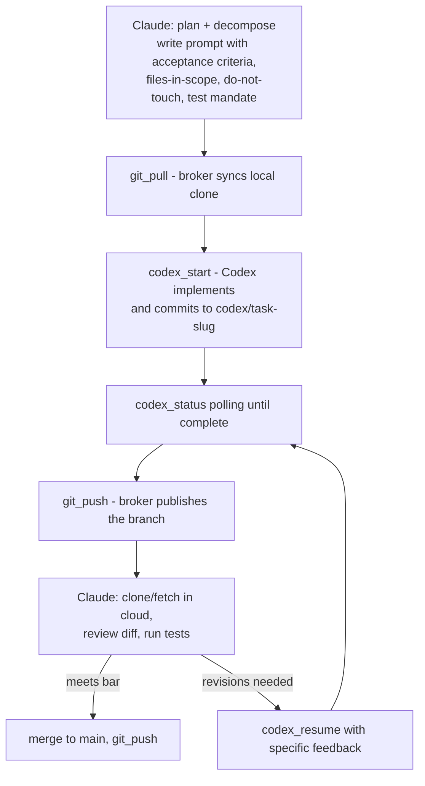

# Architecture

Three actors with strictly separated capabilities. The separation is not stylistic — every boundary below was forced by a verified constraint and confirmed in field testing.

## Actors and their boundaries

| Actor | Runs | Can | Cannot |
|---|---|---|---|
| Claude (orchestrator) | Anthropic cloud container | Plan, decompose, craft Codex prompts, review diffs, run tests, merge, clone from GitHub | Execute anything on the user's machine directly |
| Codex (GPT-5.x) | User's machine, OS-level sandbox, separate OS user | Read broadly, write inside the target project, run commands, commit locally | Network, credentials, pushing/pulling, launching other tools (e.g. `gh`) |
| Broker | User's machine, unsandboxed Node process hosted by Claude Desktop as an MCPB extension | Spawn Codex, manage background jobs; with the user's stored credentials: push/pull/commit/clone (https-only), create repos, open PRs/issues, and run allowlisted read-only gh queries (v1.5.0) | Force-push, merge PRs, escalate the Codex sandbox, accept flag injection (validated argv, stdin-fed prompts, allowlisted gh verbs) |

## Why the broker does git, not Codex

Verified empirically: the Codex sandbox on Windows runs as a separate OS user (`CodexSandboxOnline` / `CodexSandboxOffline`) and blocks the credential subsystem entirely — even *unauthenticated* HTTPS fails inside it (`SEC_E_NO_CREDENTIALS` from schannel), and `gh.exe` cannot be launched. This turns out to be the right security shape: the AI that writes code never holds credentials; the push is a deterministic, narrow, explicitly-invoked operation.

Also verified (v1.4.1): the sandbox write-protects the *existing* repo's `.git` directory (deny ACLs at session start), so Codex cannot commit in the user's clone at all — it clones the repo into its own temp dir (a session-created `.git` is writable), commits there, and the broker pushes from that clone path. See LESSONS.md #8.

Consequence for repos: files Codex creates are owned by the sandbox user, which trips git's "dubious ownership" protection for the broker/user. The broker injects a `safe.directory` exception scoped to exactly the target directory per invocation (via `GIT_CONFIG_*` env vars), so no global git config is needed.

## The delegation loop

The surrounding rules — what qualifies a task for delegation, dirty-tree handling, adversarial review triage — live in the skill (`skill/SKILL.md` and its references).

## Sync vs background: the 60-second rule

The desktop bridge caps a single MCP tool call at ~60 seconds. Verified behavior on timeout: the broker's job keeps running; only the caller's connection drops. Therefore:

- `codex_task` (synchronous) — only for jobs estimated under ~45 seconds.
- `codex_start` → `codex_status` → `codex_result` — the default for real work. Job state persists on disk (`<CODEX_BROKER_HOME>/jobs/`, default `~/.codex-broker/jobs/`) and survives broker restarts.
- Stall signal (v1.6.0): `codex_status` reports seconds since `output.log` last grew and warns past `CODEX_BROKER_STALL_WARN_SECONDS` (600). `max_idle_seconds` on `codex_start` / background `codex_review` makes the broker kill a job that goes silent — enforced on every poll and by an unref'd sweeper for jobs this broker process started, so an unpolled job still dies. Every spawn also carries `-c features.prevent_idle_sleep=true` so the host does not idle-sleep mid-turn (docs/LESSONS.md #9).
- After a sync timeout, never re-fire: find the still-running job via `codex_status` and wait for it.

## Hosting constraints (MCPB extension host)

Two non-obvious properties of running inside Claude Desktop's extension host, both verified the hard way:

1. `process.execPath` is the Claude Desktop executable, not Node — and on the Microsoft Store build `ELECTRON_RUN_AS_NODE` is dead (fuse burned), so respawning it *always* launches the GUI app. Since v1.4.0 the broker spawns Codex directly for **both** sync and background work (background: unref'd, detached on POSIX only, exit recorded by broker-side handlers; a broker restart mid-job may orphan an in-flight job, completed results persist on disk). v1.4.1: `detached` must stay **false on Windows** for background jobs too — `DETACHED_PROCESS` gives Codex no console, so every console child it spawns (powershell per command) allocates a fresh *visible* console window, one flash per command; `detached:false` + `windowsHide` gives Codex a hidden console its children inherit silently.
2. Extension updates do not restart the running server process. The version label updates while old code keeps serving. Reliable update cycle: remove the extension → quit the app from the system tray → reopen → install the new file. v1.6.0 sidesteps most of this: the bundle's entry point is `server/launch.mjs`, which runs the broker from a git checkout named by the extension's "Broker checkout" setting (`CODEX_BROKER_REPO`) when that checkout has `server/node_modules`, falling back to the bundled copy otherwise. Updating then means `git pull` and a tray-restart; the bundle only has to be rebuilt when the fallback should change.

## Windows binary resolution

npm installs `codex` as a `.cmd` shim, which Node's `spawn` cannot execute without a shell (and shelling out is banned — prompts are arbitrary text). The broker resolves the real `codex.exe` from the vendored platform package, and `gh.exe` from winget/standard locations. Overrides: `CODEX_BIN`, `GH_BIN`, `GIT_BIN`, `CODEX_MODEL`, `CODEX_BROKER_JOBS_DIR` env vars.
