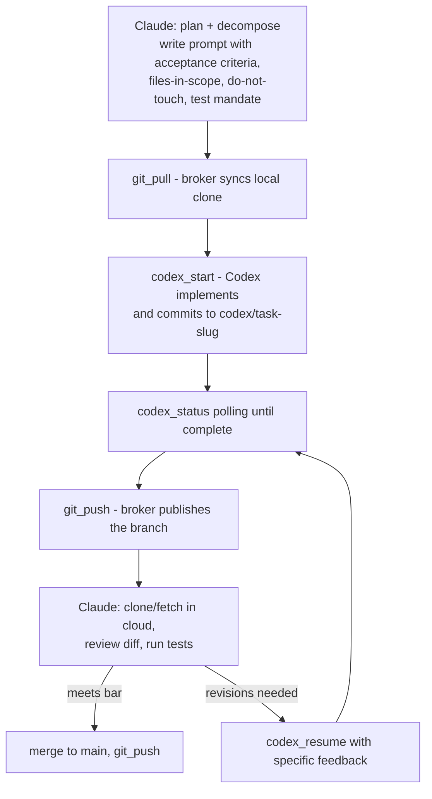

# Architecture

Three actors with strictly separated capabilities. The separation is not stylistic — every boundary below was forced by a verified constraint and confirmed in field testing.

## Actors and their boundaries

| Actor | Runs | Can | Cannot |
|---|---|---|---|
| Claude (orchestrator) | Anthropic cloud container | Plan, decompose, craft Codex prompts, review diffs, run tests, merge, clone from GitHub | Execute anything on the user's machine directly |
| Codex (GPT-5.x) | User's machine, OS-level sandbox, separate OS user | Read broadly, write inside the target project, run commands, commit locally | Network, credentials, pushing/pulling, launching other tools (e.g. `gh`) |
| Broker | User's machine, unsandboxed Node process hosted by Claude Desktop as an MCPB extension | Spawn Codex, manage background jobs, push/pull/create repos with the user's stored credentials | Force-push, escalate the Codex sandbox, accept flag injection (validated argv, stdin-fed prompts) |

## Why the broker does git, not Codex

Verified empirically: the Codex sandbox on Windows runs as a separate OS user (`CodexSandboxOnline`) and blocks the credential subsystem entirely — even *unauthenticated* HTTPS fails inside it (`SEC_E_NO_CREDENTIALS` from schannel), and `gh.exe` cannot be launched. This turns out to be the right security shape: the AI that writes code never holds credentials; the push is a deterministic, narrow, explicitly-invoked operation.

Consequence for repos: files Codex creates are owned by the sandbox user, which trips git's "dubious ownership" protection for the broker/user. The broker injects a `safe.directory` exception scoped to exactly the target directory per invocation (via `GIT_CONFIG_*` env vars), so no global git config is needed.

## The delegation loop

The surrounding rules — what qualifies a task for delegation, dirty-tree handling, adversarial review triage — live in the skill (`skill/SKILL.md` and its references).

## Sync vs background: the 60-second rule

The desktop bridge caps a single MCP tool call at ~60 seconds. Verified behavior on timeout: the broker's job keeps running; only the caller's connection drops. Therefore:

- `codex_task` (synchronous) — only for jobs estimated under ~45 seconds.
- `codex_start` → `codex_status` → `codex_result` — the default for real work. Job state persists on disk (`~/.codex-broker/jobs/`) and survives broker restarts.
- After a sync timeout, never re-fire: find the still-running job via `codex_status` and wait for it.

## Hosting constraints (MCPB extension host)

Two non-obvious properties of running inside Claude Desktop's extension host, both verified the hard way:

1. `process.execPath` is the Claude Desktop executable, not Node. Respawning it without `ELECTRON_RUN_AS_NODE=1` launches the GUI app. The broker spawns Codex directly for sync work and sets the env var for its background runner.
2. Extension updates do not restart the running server process. The version label updates while old code keeps serving. Reliable update cycle: remove the extension → quit the app from the system tray → reopen → install the new file.

## Windows binary resolution

npm installs `codex` as a `.cmd` shim, which Node's `spawn` cannot execute without a shell (and shelling out is banned — prompts are arbitrary text). The broker resolves the real `codex.exe` from the vendored platform package, and `gh.exe` from winget/standard locations. Overrides: `CODEX_BIN`, `GH_BIN`, `GIT_BIN`, `CODEX_MODEL`, `CODEX_BROKER_JOBS_DIR` env vars.
