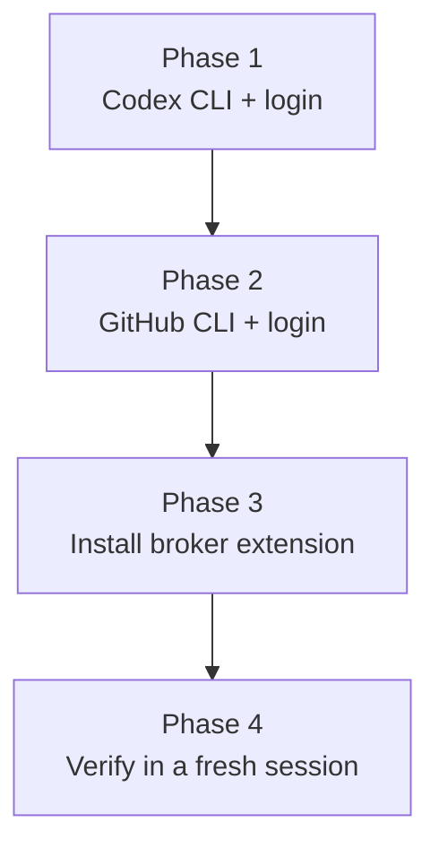

# Windows Install Guide

Target: ~20 minutes to a working setup where any Cowork session can delegate coding tasks to Codex on your machine. All commands run in regular PowerShell (Win key → type `powershell` → Enter). No administrator mode needed.



## Phase 1 — Codex CLI

- [ ] **1.1** If PowerShell blocks npm with an execution-policy error, run once:

  ```powershell
  Set-ExecutionPolicy -ExecutionPolicy RemoteSigned -Scope CurrentUser
  ```

- [ ] **1.2** Check Node (`node -v`, need 18.18+; if missing: `winget install OpenJS.NodeJS.LTS`, then reopen PowerShell), then:

  ```powershell
  npm install -g @openai/codex
  codex login
  ```

  Sign in with your ChatGPT account (any plan) or API key.

- [ ] **1.3** Health check:

  ```powershell
  codex doctor
  ```

  Confirm the **sandbox** section reports restricted filesystem and network. If it reports no enforcement, run reviews only — don't give write delegations.

## Phase 2 — GitHub CLI

- [ ] **2.1** Install and authenticate:

  ```powershell
  winget install --id GitHub.cli
  ```

  Reopen PowerShell, then:

  ```powershell
  gh auth login
  ```

  Choices: GitHub.com → HTTPS → Yes (authenticate Git) → Login with a web browser. This also wires git's credential helper — no separate git auth needed.

## Phase 3 — Install the broker extension

- [ ] **3.0** Download `codex-broker.mcpb` and `codex-delegation.skill` from the [latest release](https://github.com/GhengisPliskin/claude-desktop-codex-broker/releases/latest). CI builds them from the tagged source; they are not committed to the repo.
- [ ] **3.1** In Claude Desktop: **Settings → Extensions** → drag `codex-broker.mcpb` onto the page (or use "Install extension…").
- [ ] **3.2** Approve the prompt; confirm the extension shows as enabled.
- [ ] **3.3** Save `codex-delegation.skill` to your Claude account (upload it in a conversation, or Settings → Skills).

## Phase 4 — Verify

- [ ] **4.1** Start a **new** Cowork task and ask Claude: "Do you see the Codex broker tools?" — it should find `mcp__remote-devices__Codex_Broker__*`.
- [ ] **4.2** Have it run a trivial `codex_task` (create a hello.txt in a scratch folder) and confirm the file appears on your disk.

## Updating the broker

Extension updates do NOT restart the running server — the version card will lie to you. Full cycle, every time:

1. Delete old `.mcpb` files from Downloads (avoid grabbing a stale one).
2. Settings → Extensions → remove the Codex Broker.
3. Quit Claude Desktop from the **system tray** (closing the window is not enough).
4. Reopen, install the new file.

## Troubleshooting

| Symptom | Cause / fix |
|---|---|
| Tools don't appear in a session | Extension not enabled, or app not fully restarted after install (tray-quit) |
| `codex_task` fails instantly, no output | Check `%USERPROFILE%\.codex-broker\jobs\<id>\output.log` and `runner-boot.log` |
| Push fails: "dubious ownership" | Broker v1.3.1+ handles this automatically; on older versions: `git config --global --add safe.directory "<project path>"` |
| Push fails: auth error | `gh auth status` in PowerShell; re-run `gh auth login` if expired |
| Job fails with rate-limit message in its log | Your ChatGPT plan's Codex usage limit — wait for the window to reset or switch to API-key auth |
| Behavior matches an older version than the card shows | Stale server process — run the full update cycle above |
