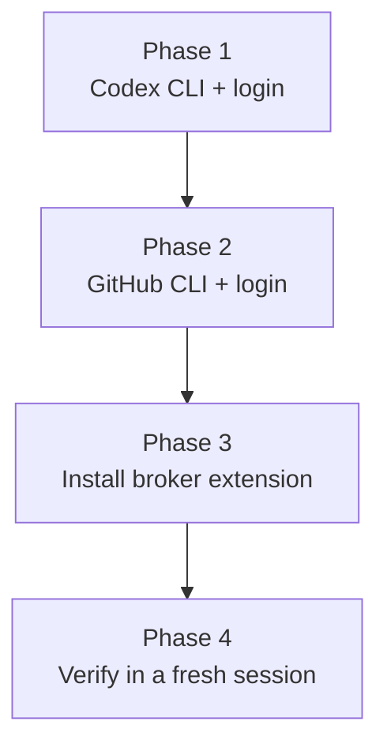

# Windows Install Guide

Target: ~20 minutes to a working setup where any Cowork session can delegate coding tasks to Codex on your machine. All commands run in regular PowerShell (Win key → type `powershell` → Enter), except the one-time Codex sandbox setup in step 1.3, which needs an administrator PowerShell.


```mermaid
flowchart TD
    A[Phase 1\nCodex CLI + login] --> B[Phase 2\nGitHub CLI + login]
    B --> C[Phase 3\nInstall broker extension]
    C --> D[Phase 4\nVerify in a fresh session]
```

## Phase 1 — Codex CLI

- [ ] **1.1** If PowerShell blocks npm with an execution-policy error, run once:

  ```powershell
  Set-ExecutionPolicy -ExecutionPolicy RemoteSigned -Scope CurrentUser
  ```

- [ ] **1.2** Check Node (`node -v`, need 18.18+; if missing: `winget install OpenJS.NodeJS.LTS`, then reopen PowerShell), then:

  ```powershell
  npm install -g @openai/codex
  codex login
  ```

  Sign in with your ChatGPT account (any plan) or API key.

- [ ] **1.3** Set up Codex's sandbox (once per machine). Codex runs its commands as dedicated sandbox users, and creating them needs administrator rights. Start menu → type `PowerShell` → right-click **Windows PowerShell** → **Run as administrator**, then:

  ```powershell
  & "$env:APPDATA\npm\codex.cmd" sandbox setup --elevated --current-user
  ```

  Close the administrator window when it finishes; nothing else should run elevated. Skip this and Codex still answers prompts, but every command it tries fails with "blocked by policy" ([LESSONS #11](LESSONS.md)).

- [ ] **1.4** Health check, back in regular PowerShell:

  ```powershell
  codex doctor
  ```

  The **sandbox** section should read `restricted fs + restricted network`, with `sandbox backend  elevated` and `sandbox provisioning  complete`. If it doesn't, redo 1.3; don't give Codex work until it does.

## Phase 2 — GitHub CLI

- [ ] **2.1** Install and authenticate:

  ```powershell
  winget install --id GitHub.cli
  ```

  Reopen PowerShell, then:

  ```powershell
  gh auth login
  ```

  Choices: GitHub.com → HTTPS → Yes (authenticate Git) → Login with a web browser. This also wires git's credential helper — no separate git auth needed.

## Phase 3 — Install the broker extension

- [ ] **3.0** Download `codex-broker.mcpb` and `codex-delegation.skill` from the [latest release](https://github.com/Pliskin-Industries/claude-desktop-codex-broker/releases/latest). CI builds them from the tagged source; they are not committed to the repo.
- [ ] **3.1** In Claude Desktop: **Settings → Extensions** → drag `codex-broker.mcpb` onto the page (or use "Install extension…").
- [ ] **3.2** Approve the prompt; confirm the extension shows as enabled.
- [ ] **3.3** *(Recommended, once)* Point the extension at a live checkout so future updates need no rebuild or reinstall: `git clone https://github.com/Pliskin-Industries/claude-desktop-codex-broker.git`, run `npm ci --prefix server` inside it, then in the extension's settings set **Broker checkout** to that folder. The launcher runs `server/server.mjs` from there and falls back to the bundled copy if the folder is missing or has no `node_modules`.
- [ ] **3.4** Save `codex-delegation.skill` to your Claude account (upload it in a conversation, or Settings → Skills).

## Phase 4 — Verify

- [ ] **4.1** Start a **new** Cowork task and ask Claude: "Do you see the Codex broker tools?" — it should find `mcp__remote-devices__Codex_Broker__*`.
- [ ] **4.2** Have it run a trivial `codex_task` (create a hello.txt in a scratch folder) and confirm the file appears on your disk.

## Updating the broker

**If the extension points at a checkout (step 3.3):** one command, from the clone:

```powershell
node scripts/update-broker.mjs
```

It runs `git pull --ff-only`, reinstalls server dependencies only if `server/package.json` or its lockfile changed, runs the test suite, and, if the tests pass, restarts Claude Desktop. The restart stops only Claude Desktop's own processes (not a Claude Code CLI you run in a terminal), waits until they are all gone, and reopens the app. It works from inside a Claude session too: that session ends with the app, and you reopen it afterwards. Progress of the restart goes to `%TEMP%\codex-broker-restart.log`.

- `--restart-only` just restarts the app. Use it after installing or upgrading Node or the Codex CLI: a running app keeps the PATH it started with ([LESSONS #10](LESSONS.md)).
- `--no-restart` updates and tests now and leaves the restart for later.
- `--dry-run` prints what it would do and changes nothing.

The running server process never restarts on its own, so the restart is the whole update. No download, no rebuild, no reinstall. Which code is live is printed on the broker's stderr at start: `codex-broker launcher: running from checkout <path>` or `running bundled server (<reason>)`.

By hand: `git pull`, `npm ci --prefix server` if the dependency files changed, then quit Claude Desktop from the **system tray** and confirm in Task Manager that no **Claude** processes remain (end them if they do) before reopening. A tray quit does not always end the app.

**If it runs the bundled copy:** extension updates do NOT restart the running server — the version card will lie to you. Full cycle, every time:

1. Delete old `.mcpb` files from Downloads (avoid grabbing a stale one).
2. Settings → Extensions → remove the Codex Broker.
3. Quit Claude Desktop from the **system tray** (closing the window is not enough).
4. Reopen, install the new file.

**The skill** is a file uploaded to your Claude account, so a skill change still means re-uploading `codex-delegation.skill` from the release (or the `skill/` folder contents). Skill changes are rare; server changes are not, which is why the checkout path exists.

## Troubleshooting

| Symptom | Cause / fix |
|---|---|
| Tools don't appear in a session | Extension not enabled, or app not fully restarted after install (tray-quit) |
| `codex_task` fails instantly, no output | Check `%USERPROFILE%\.codex-broker\jobs\<id>\output.log` |
| `spawn codex.exe ENOENT` right after installing Node or Codex | The app was started before the install and still has the old PATH, even after a tray quit. `node scripts/update-broker.mjs --restart-only`, or end **Claude** in Task Manager and reopen it ([LESSONS #10](LESSONS.md)) |
| Job log full of `No such host is known (os error 11001)` / `Reconnecting… n/5` | The machine slept or Wi-Fi dropped, not DNS ([LESSONS #9](LESSONS.md)). `codex_status` / `codex_result` print an automatic forensics verdict for such jobs; keep the laptop on AC with the lid open for long runs |
| Push fails: "dubious ownership" | Broker v1.3.1+ handles this automatically; on older versions: `git config --global --add safe.directory "<project path>"` |
| Push fails: auth error | `gh auth status` in PowerShell; re-run `gh auth login` if expired |
| Job fails with rate-limit message in its log | Your ChatGPT plan's Codex usage limit — wait for the window to reset or switch to API-key auth |
| Behavior matches an older version than the card shows | Stale server process — run the full update cycle above |
